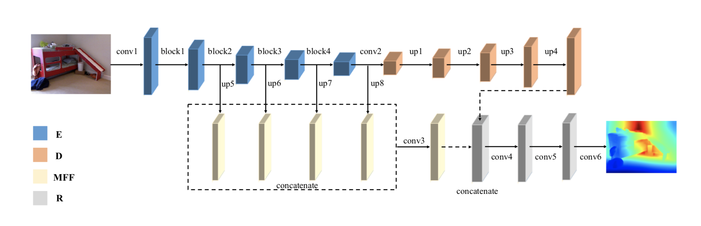
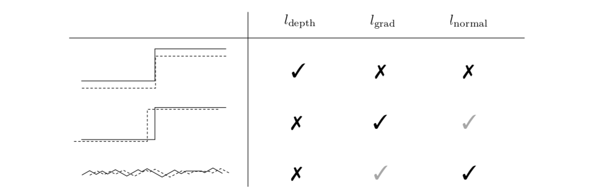
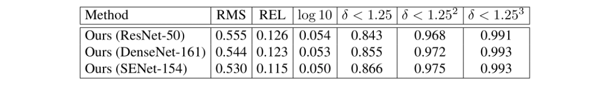
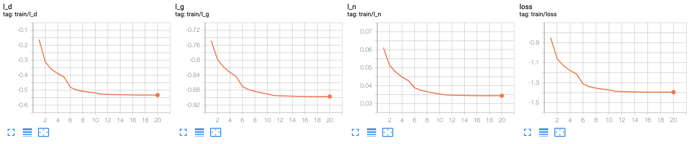
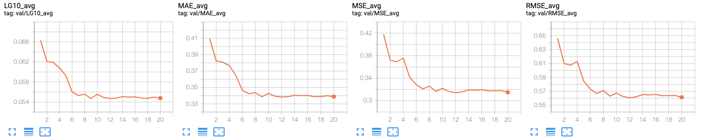
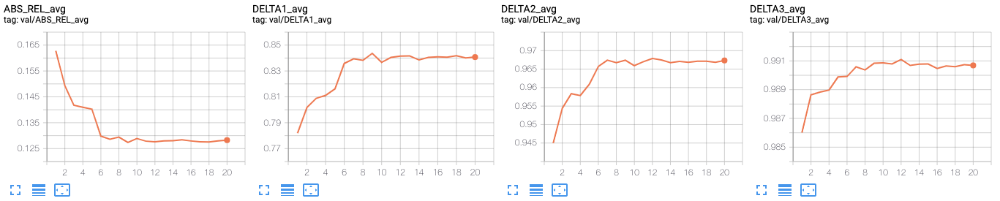
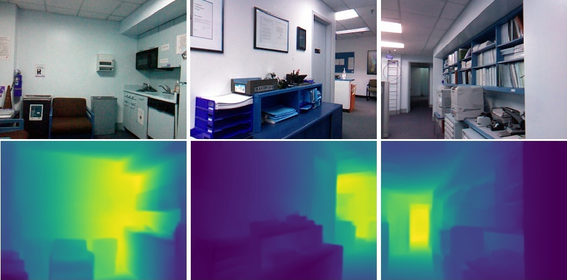

# Monocular Depth Estimation for [NYU2](https://cs.nyu.edu/~silberman/datasets/nyu_depth_v2.html)

Pytorch re-implementation of the below paper.

- Python 3.6.8
- PyTorch 1.6.0

Please see [requirements.txt](./docker/requirements.txt) for the other libraries' versions.


## Paper

**Revisiting Single Image Depth Estimation: Toward Higher Resolution Maps with Accurate Object Boundaries**

*Junjie Hu, Mete Ozay, Yan Zhang, Takayuki Okatani*

WACV2019

[[arXiv]](https://arxiv.org/abs/1803.08673) [[Original repo]](https://github.com/JunjH/Revisiting_Single_Depth_Estimation)




Results in the paper:



*The figures are from the paper.

## Results in this repository

We use ResNet-50 for the main results. Please see [the config file](./configs/default.yaml) for the other parameters.

### Training loss



### Quantitative results

MAE | MSE | RMSE | ABS_REL | LG10 | DELTA1 | DELTA2 | DELTA3
-- | -- | -- | -- | -- | -- | -- | --
0.3388 | 0.3150 | 0.5613 | 0.1283 | 0.0548 | 0.8407 | 0.9673 | 0.9907




### Qualitative results



### Others

The results about other metrics and the ablation study results are [here](./docs/RESULTS.md).

## Preparation

### Dataset: NYU v2

```bash
sh scripts/prepare_nyu2.sh
```

[This script](./scripts/download_nyu2.sh) uses the downloading link in [J. Hue's repository](https://github.com/JunjH/Revisiting_Single_Depth_Estimation).


### Installation

```bash
docker-compose build
docker-compose run dev
```

- docker-compose 1.28.3
- Docker 20.10.2

ref. [[Enabling GPU access with Compose]](https://docs.docker.com/compose/gpu-support/)


### Installation w/ nvidia-docker

```bash
nvidia-docker build -t {IMAGE_NAME} ./docker
nvidia-docker run -it -v `pwd`:/work -v $HOME/data/nyu2/data:/work/data --name {CONTAINER_NAME} {IMAGE_NAME}
```

Please mount your working directory on `/work`, and the dataset path on `/work/data`.

### Installation w/o Docker

```bash
pip install -r ./docker/requirements.txt
```

Note that the libraries will be installed into your environment.

Please place the dataset in `./data` in your working directory, or change the dataset path in your config file.


## Run

### Train
```bash
python tools/train.py
```

Option | Description
--- | ---
`--config [config path]` | Optional config file path. The `configs/default.yaml` is loaded by default. The specified file overwrites the default configs.
`--out-dir [outdir path]`  | Output directory path. (default: `results`)
`--resume [ckpt path]` | Resuming checkpoint file path. 

If you want to override the config with command line args, put them at the end in the form of dotlist.

```bash
python tools/train.py --config [config path] SOLVER.NUM_WORKERS=8 SOLVER.EPOCH=5
```

### Test
```bash
python tools/test.py [ckpt path]
```

Option | Description
--- | ---
`--config [config path]` | The optional config file path.used when training.
`--show-dir [outdir path]`  | Path to save predict visualization. Please specify if you want to save.

### Other tools
Please see [tools/README.md](./tools/README.md).


## Credit

```
@inproceedings{Hu2019RevisitingSI,
  title={Revisiting Single Image Depth Estimation: Toward Higher Resolution Maps With Accurate Object Boundaries},
  author={Junjie Hu and Mete Ozay and Yan Zhang and Takayuki Okatani},
  journal={2019 IEEE Winter Conference on Applications of Computer Vision (WACV)},
  year={2019}
}
```
