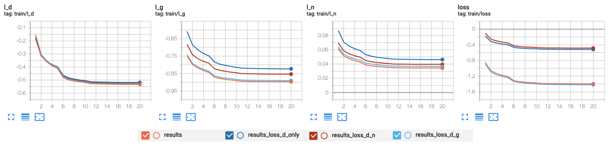
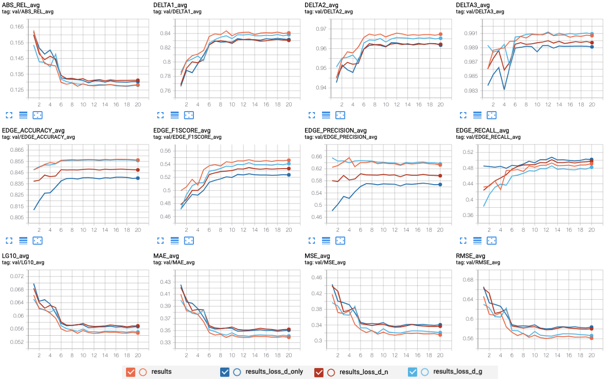
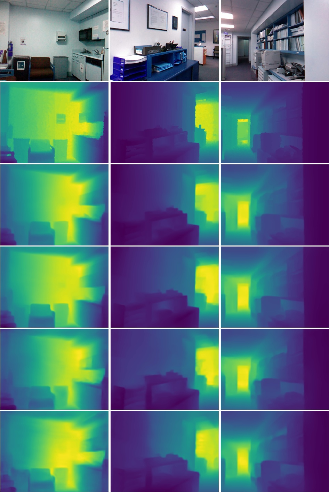

# All results

The configuration files for all the experiments described below are stored [here](../configs/exps).

### Training loss

### Quantitative results

depth loss | grad loss | norm loss | MAE | MSE | RMSE | ABS_REL | LG10 | DELTA1 | DELTA2 | DELTA3
-- | -- | -- | -- | -- | -- | -- | -- | -- | -- | --
✔ | ✔ | ✔ | 0.3388 | 0.3150 | 0.5613 | 0.1283 | 0.0548 | 0.8407 | 0.9673 | 0.9907
✔ | ✔ |   | 0.3408 | 0.3208 | 0.5664 | 0.1281 | 0.0551 | 0.8381 | 0.9653 | 0.9909
✔ |   | ✔ | 0.3519 | 0.3370 | 0.5805 | 0.1311 | 0.0570 | 0.8304 | 0.9622 | 0.9897
✔ |   |   | 0.3505 | 0.3408 | 0.5838 | 0.1303 | 0.0567 | 0.8314 | 0.9618 | 0.9891

### Other metrics

depth loss | grad loss | norm loss | EDGE_ACCURACY | EDGE_PRECISION | EDGE_RECALL | EDGE_F1SCORE
-- | -- | -- | -- | -- | -- | --
✔ | ✔ | ✔ | 0.8562 | 0.6325 | 0.4913 | 0.5461
✔ | ✔ |   | 0.8558 | 0.6360 | 0.4823 | 0.5409
✔ |   | ✔ | 0.8474 | 0.5969 | 0.4972 | 0.5334
✔ |   |   | 0.8401 | 0.5679 | 0.5020 | 0.5238

### Qualitative results

Each column has the visualizations for the same data.

From top to down...

- input images
- gt depth visualization
- prediction visualization w/ full loss
- prediction visualization w/ depth loss + grad loss
- prediction visualization w/ depth loss + norm loss
- prediction visualization w/ only depth loss

